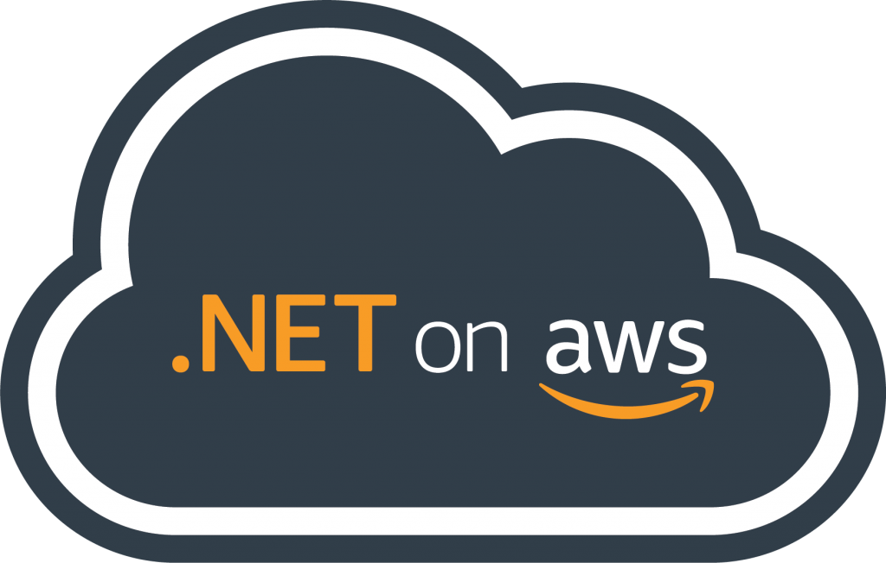
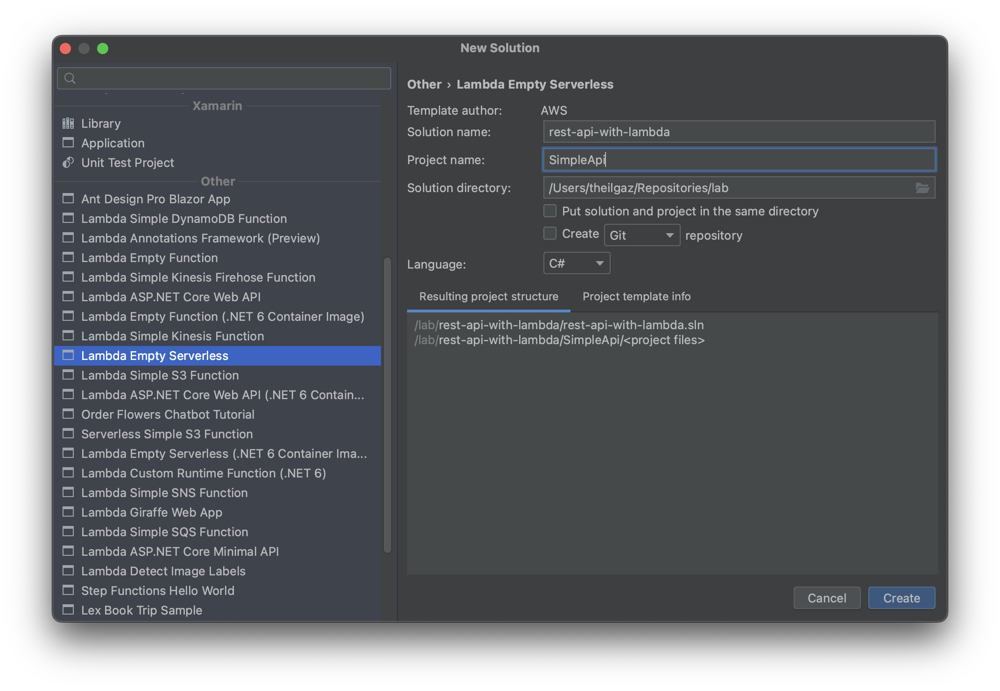
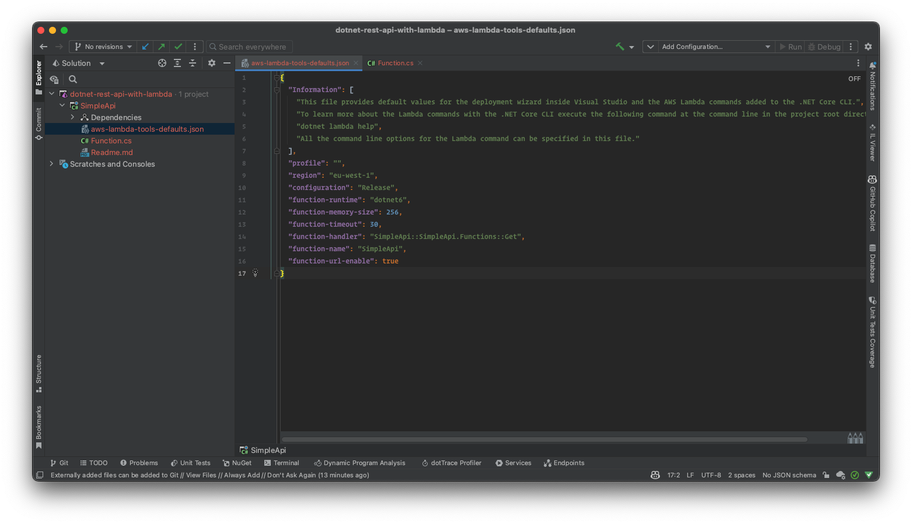
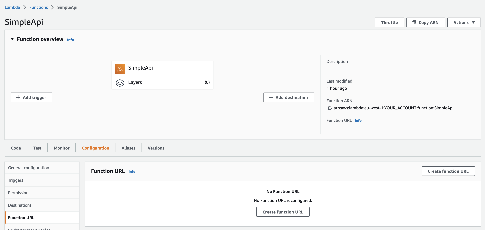
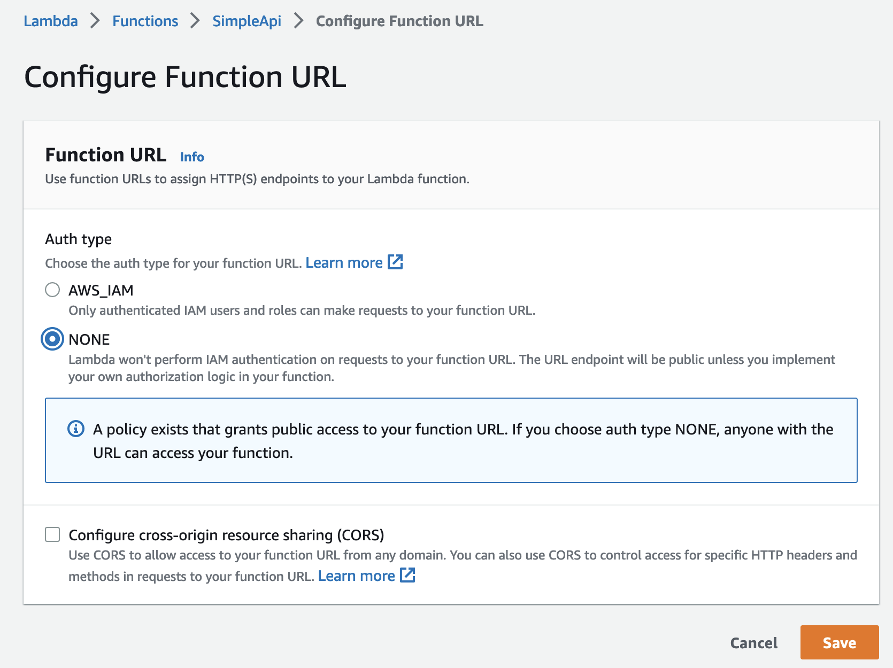
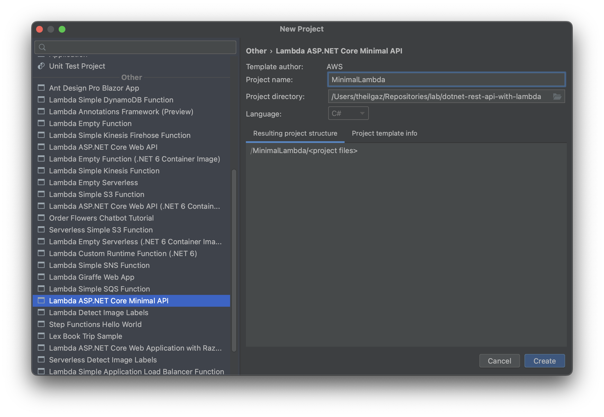
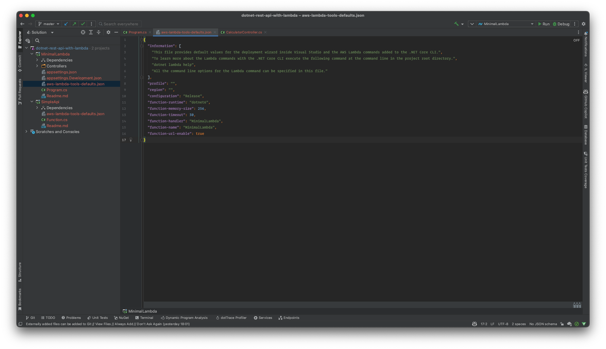

<div align='center'>

</div>

# Serverless REST API in .NET 6 with AWS Lambda

This is a main repository for the `Serverless REST API in .NET 6 with AWS Lambda` course.

## Overview

| Project | Description |
| --- | --- |
| [SimpleApi](#SimpleApi) | Simple REST API with AWS Lambda |
| [MinimalLambda](#MinimalLambda) | Minimal API (using Controller) with AWS Lambda |
| [SimpleApiWithDynamoDb](#SimpleApiWithDynamoDb) | Simple REST API with AWS Lambda and DynamoDB |

---

## SimpleApi

This is a very quick demo of how to create a serverless rest API using `AWS Lambda` and `.NET 6`. The project is created using the `dotnet new` command and the `Amazon.Lambda.Templates` NuGet package.

#### Installing AWS Lambda Templates

Install the AWS Lambda templates for .NET 6 using the following command:

```bash
dotnet new -i Amazon.Lambda.Templates
```

If already installed check the installed templates using the following command:

```bash
dotnet new --list
```

Install Amazon.Lambda.Tools Global Tools if not already installed.
```bash
dotnet tool install -g Amazon.Lambda.Tools
```

If already installed check if new version is available.
```bash
dotnet tool update -g Amazon.Lambda.Tools
```

#### Creating a new project


|Template Name|Short Name|Language|Tags|
|--|--|--|--|
|Lambda Empty Serverless                               |serverless.EmptyServerless                   | [C#],F# |     AWS/Lambda/Serverless |

We will create a new project using the `serverless.EmptyServerless` template. 

##### dotnet CLI

```bash
dotnet new serverless.EmptyServerless --name SimpleApi --output dotnet-rest-api-with-lambda
```

##### Rider IDE



#### Configuring the project

This project's purpose is only demostrating how to create a serverless rest API using `AWS Lambda` and `.NET 6`. 

We don't need `serverless.template` file. So, we can delete it.

Now we need to configure `aws-lambda-tools-defaults.json` file. 



We must set `function-runtime` to `dotnet6`, `function-memory-size` to `256` and `function-timeout` to `30`.

`function-handler` is the name of the class that will handle the request. In this project, we will use <strong>`SimpleApi::SimpleApi.Functions::Get`</strong> as the handler.

First part is the assembly name, second part is the namespace and the class name. Last part is the method name.

#### Looking at the code

We have a `Get` method in `Functions` class. This method will handle the request. 

```csharp
public APIGatewayProxyResponse Get(APIGatewayProxyRequest request, ILambdaContext context)
{
    return new APIGatewayProxyResponse
    {
        StatusCode = 200,
        Body = "Hello World!",
        Headers = new Dictionary<string, string> { { "Content-Type", "text/plain" } }
    };
}
```

#### Deploying the project

Now that we have created the project, we can deploy it to AWS Lambda. Go to the project directory and run the following command:

```bash
dotnet lambda deploy-function
```

#### Configuring the Lambda function on AWS Console

We need to configure the Lambda function on AWS Console.

In the `Configuration` tab, we need to create a new `Function URL`.



The auth type should be `NONE`. Then click on `Save`.



#### Congratulations!

You have created a serverless rest API using `AWS Lambda` and `.NET 6`.

---

## MinimalLambda

We will create a minimal API using `AWS Lambda` and `.NET 6`. It will be a simple API with a single MapGet method and a single controller which is a simple calculator class with four methods.

#### Creating a new project

We are going to use the `serverless.AspNetCoreMinimalAPI` template. You can create a new project using the following command:

```bash
dotnet new serverless.AspNetCoreMinimalAPI --name MinimalLambda --output MinimalLambda
```

or using the Rider IDE.



#### Configuring the project

We need to configure `aws-lambda-tools-defaults.json` file.

This time we will use `function-handler` as `MinimalLambda`. Then we can remove `serverless.template` file.



#### Looking at the code

In the `Program.cs` file, we have a `CreateHostBuilder` method. This method will create a new `IHostBuilder` instance.

```csharp
var builder = WebApplication.CreateBuilder(args);

// Add services to the container.
builder.Services.AddControllers();

// Add AWS Lambda support. When application is run in Lambda Kestrel is swapped out as the web server with Amazon.Lambda.AspNetCoreServer. This
// package will act as the webserver translating request and responses between the Lambda event source and ASP.NET Core.
builder.Services.AddAWSLambdaHosting(LambdaEventSource.RestApi);

var app = builder.Build();


app.UseHttpsRedirection();
app.UseAuthorization();
app.MapControllers();

app.MapGet("/", () => "Welcome to running ASP.NET Core Minimal API on AWS Lambda");

app.Run();
```

`LambdaEventSource.RestApi` is the event source that will be used to handle the request. If we change it to `LambdaEventSource.HttpApi`, we will be able to use the new HTTP API.

```csharp
builder.Services.AddAWSLambdaHosting(LambdaEventSource.HttpApi);
```

In the Controllers folder, we have a `CalculatorController.cs` file. This file contains a `Calculator` class with four methods. We can use these methods to perform simple calculations.

#### Deploying the project

Now that we have created the project, we can deploy it to AWS Lambda. Go to the project directory and run the following command:

```bash
dotnet lambda deploy-function
```

With `"function-url-enable": true` in `aws-lambda-tools-defaults.json` file, we can get the function URL after deploying the project.

Now we can use the function URL to access the API.

They can be accessed using the following URLs:

- `https://<function-url>/calculator/add/1/2`
- `https://<function-url>/calculator/subtract/1/2`
- `https://<function-url>/calculator/multiply/1/2`
- `https://<function-url>/calculator/divide/1/2`

With `Postman`, we can send a request to these URLs and get the result.

#### Congratulations!

You have created a minimal API using `AWS Lambda` and `.NET 6`.

---

## SimpleApiWithDynamoDB

We are going to create a new project with a simple API and a DynamoDB table. We will use the `serverless.AspNetCoreMinimalAPI` template. 

In this project we need some NuGet packages. We will use `AWSSDK.DynamoDBv2` and `Amazon.Lambda.AspNetCoreServer.Hosting` with `FastEndpoints`, `FastEndpoints.Swagger` and `ValueOf` packages.


#### Adding the Domain

We will add a `Domain` folder to the project. In this folder, we will add a `User` class and a `Common` folder. 

In the `Common` folder, we will add `UserId`, `FullName`, `EmailAddress` and `Password` classes. You can find the code for these classes in the [here](/SimpleApiWithDynamoDb/src/SimpleApiWithDynamoDb/Domain/).

```
|-- Domain
    |-- Common
        |-- EmailAddress.cs
        |-- FullName.cs
        |-- Password.cs
        |-- UserId.cs
    |-- User.cs
```

#### Adding the Contracts

We will add a `Contracts` folder to the project. In this folder, we will add `Data`, `Requests` and `Responses` folders. 

In the `Data` folder, we will add `UserDto` class. In the `Requests` folder, we will add `CreateUserRequest`, `DeleteUserRequest`, `GetUserRequest` and `UpdateUserRequest` classes. 

In the `Responses` folder, we will add `UserResponse`,`GetAllUsersResponse` and `ValidationFailureResponse` classes. You can find the code for these classes in the [here](/SimpleApiWithDynamoDb/src/SimpleApiWithDynamoDb/Contracts/).

```
|-- Contracts
    |-- Data
        |-- UserDto.cs
    |-- Requests
        |-- CreateUserRequest.cs
        |-- DeleteUserRequest.cs
        |-- GetUserRequest.cs
        |-- UpdateUserRequest.cs
    |-- Responses
        |-- GetAllUsersResponse.cs
        |-- UserResponse.cs
        |-- ValidationFailureResponse.cs
```

#### Adding the Mapping

We will add a `Mapping` folder to the project. In this folder, we will add `ApiContractToDomainMapper`, `DomainToApiContractMapper`, `DomainToDtoMapper` and `DtoToDomainMapper` classes.

You can find the code for these classes in the [here](/SimpleApiWithDynamoDb/src/SimpleApiWithDynamoDb/Mapping/).

```
|-- Mapping
    |-- ApiContractToDomainMapper.cs
    |-- DomainToApiContractMapper.cs
    |-- DomainToDtoMapper.cs
    |-- DtoToDomainMapper.cs
```

#### Adding the Repositories

We will add a `Repositories` folder to the project. In this folder, we will add `IUserRepository` interface and `UserRepository` class.

You can find the code for this interface and class in the [here](/SimpleApiWithDynamoDb/src/SimpleApiWithDynamoDb/Repositories/).

```
|-- Repositories
    |-- IUserRepository.cs
    |-- UserRepository.cs
```
 
#### Adding the Services

We will add a `Services` folder to the project. In this folder, we will add `IUserService` interface and `UserService` class.

You can find the code for this interface and class in the [here](/SimpleApiWithDynamoDb/src/SimpleApiWithDynamoDb/Services/).

```

|-- Services
    |-- IUserService.cs
    |-- UserService.cs
```

#### Adding the Endpoints

We will add a `Endpoints` folder to the project. In this folder, we will add `CreateUserEndpoint`, `DeleteUserEndpoint`, `GetUserEndpoint` and `UpdateUserEndpoint` classes.

You can find the code for these classes in the [here](/SimpleApiWithDynamoDb/src/SimpleApiWithDynamoDb/Endpoints/).

```
|-- Endpoints
    |-- CreateUserEndpoint.cs
    |-- DeleteUserEndpoint.cs
    |-- GetUserEndpoint.cs
    |-- UpdateUserEndpoint.cs
```


#### Adding the Summaries

We will add a `Summaries` folder to the project. In this folder, we will add `CreateUserSummary`, `DeleteUserSummary`, `GetUserSummary` and `UpdateUserSummary` classes.

You can find the code for these classes in the [here](/SimpleApiWithDynamoDb/src/SimpleApiWithDynamoDb/Summaries/).

```
|-- Summaries
    |-- CreateUserSummary.cs
    |-- DeleteUserSummary.cs
    |-- GetUserSummary.cs
    |-- UpdateUserSummary.cs
```

#### Adding the Validators

We will add a `Validation` folder to the project. In this folder, we will add `CreateUserRequestValidator`, `UpdateUserRequestValidator` and `ValidationExceptionMiddleware` classes.

You can find the code for these classes in the [here](/SimpleApiWithDynamoDb/src/SimpleApiWithDynamoDb/Validation/).

```
|-- Validation
    |-- CreateUserRequestValidator.cs
    |-- UpdateUserRequestValidator.cs
    |-- ValidationExceptionMiddleware.cs
```

#### Program.cs Configurations

##### Enabling Lambda Hosting

We need to enable Lambda hosting in `Program.cs` file.

```csharp
builder.Services.AddAWSLambdaHosting(LambdaEventSource.HttpApi);
```

##### FastEndpoints Configuration

Now we add `FastEndpoints` and swagger services.

```csharp
builder.Services.AddFastEndpoints();
builder.Services.AddSwaggerDoc();
```

##### DynamoDB Configuration

We need to configure DynamoDB in `Program.cs` file. We will use `AmazonDynamoDBClient` to connect to DynamoDB.

```csharp
builder.Services.AddSingleton<IAmazonDynamoDB>(_ => new AmazonDynamoDBClient(RegionEndpoint.EUWest1));
```

##### Adding Repository and Service

We will add `UserRepository` and `UserService` to the services.

```csharp
builder.Services.AddSingleton<IUserRepository>(provider =>
    new UserRepository(provider.GetRequiredService<IAmazonDynamoDB>(),
        config.GetValue<string>("Database:TableName")));
builder.Services.AddSingleton<IUserService, UserService>();
```

##### Adding Validators

We will add ValidationExceptionMiddleware to the services.

```csharp
app.UseMiddleware<ValidationExceptionMiddleware>();
app.UseFastEndpoints(x =>
{
    x.ErrorResponseBuilder = (failures, _) =>
    {
        return new ValidationFailureResponse
        {
            Errors = failures.Select(y => y.ErrorMessage).ToList()
        };
    };
});

```

##### Adding Database Table Name to Configuration

We will add `Database:TableName` to the `appsettings.json` configuration file.

```
{
  "Database": {
    "TableName": "users"
  }
}
```

#### Deploying the project

We will deploy the project to AWS Lambda using the following command.

```
dotnet lambda deploy-function
```

#### Creating the Database Table

In AWS Console, go to DynamoDB service and create a table with the name `users`. The table should have a part key with the name `pk` and type `String`. The table should have a sort key with the name `sk` and type `String`. 

After creating the table, click the `Actions` button and select `Create access control policy`. `Identity provider` should be `Login with Amazon` and all permissions should be selected. Click `Generate policy` button. 

The generated policy will be like this:

```
{
  "Version": "2012-10-17",
  "Statement": [
    {
      "Effect": "Allow",
      "Action": [
        "dynamodb:BatchGetItem",
        "dynamodb:BatchWriteItem",
        "dynamodb:DeleteItem",
        "dynamodb:GetItem",
        "dynamodb:PutItem",
        "dynamodb:Query",
        "dynamodb:UpdateItem"
      ],
      "Resource": [
        "arn:aws:dynamodb:eu-west-1:YOUR_ACCOUNT:table/users"
      ],
      "Condition": {
        "ForAllValues:StringEquals": {
          "dynamodb:LeadingKeys": [
            "${www.amazon.com:user_id}"
          ]
        }
      }
    }
  ]
}
```

We don't need the `Condition` part. So we will remove it. The policy will be like this:

```
{
  "Version": "2012-10-17",
  "Statement": [
    {
      "Effect": "Allow",
      "Action": [
        "dynamodb:BatchGetItem",
        "dynamodb:BatchWriteItem",
        "dynamodb:DeleteItem",
        "dynamodb:GetItem",
        "dynamodb:PutItem",
        "dynamodb:Query",
        "dynamodb:UpdateItem"
      ],
      "Resource": [
        "arn:aws:dynamodb:eu-west-1:YOUR_ACCOUNT:table/users"
      ]
    }
  ]
}
```

Now copy the policy. We will use it in the next step.

#### Configuring the Policy

In AWS Console, go to Lambda service and select the function we created. In the `Configuration` tab, click the `Permissions` page. Click the execution role and it will open the IAM service. In the IAM service, click the `Add permissions` button then click the `Create inline policy` button. 

Go to JSON tab and paste the policy we created in the previous step. Click `Review policy` button. Give a name to the policy and click `Create policy` button.

#### Congratulations!

We have created a simple API with DynamoDB. You can test the API using the Postman.
